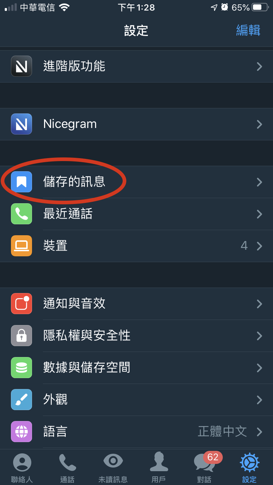
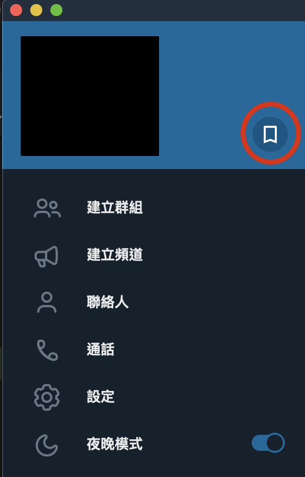

## 私人雲端
TG就是一個無限的雲端儲存空間，為什麼可以這樣說呢？  
1) 傳送出去的訊息、圖片、影片、檔案等皆不會過期
2) 不分裝置，只要同一帳號登入，皆可存取到同樣的內容
3) 無限的空間傳送訊息

---
---

### 如何操作
1) 手機版  
    

2) 電腦版   
    

---

🌟不過其實還有更快的作法，手機版及電腦版是一樣的。  
> 對著想儲存的訊息、檔案、圖片、影片等按右鍵(或長按) > 點選「轉傳訊息」 > 選擇「儲存的訊息」

---

[🔱Home](../README.md) [⬆️Top](#私人雲端)

---
### [⬅️2-2一般設定](./2-2一般設定.md) | [2-4偷偷已讀不顯示➡️](./2-4偷偷已讀不顯示.md)