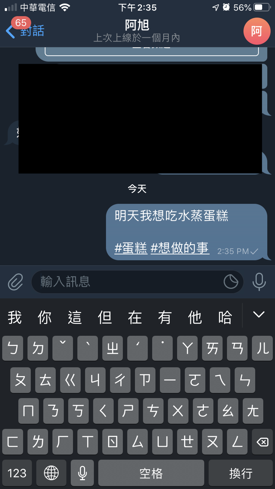
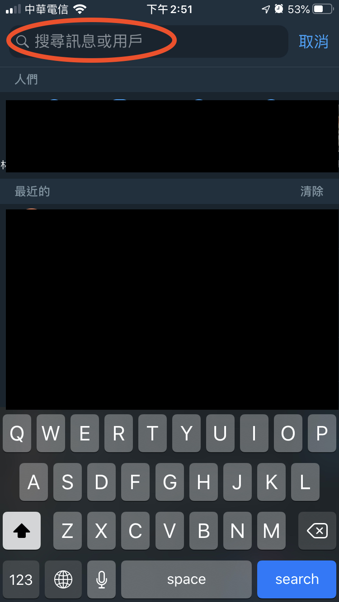
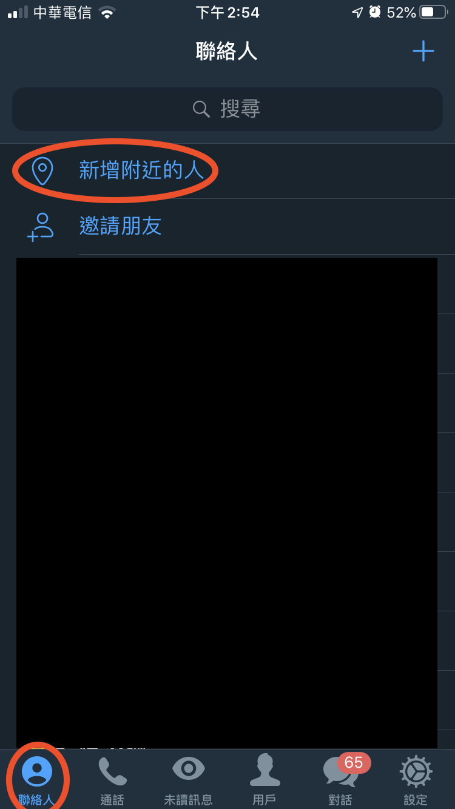

## 超強搜尋功能

## 大綱
* [善用標籤(#)](#善用標籤《#》)
* [搜尋朋友帳號](#搜尋朋友帳號)
* [搜尋機器人](#搜尋機器人)
* [搜尋附近的人](#搜尋附近的人)

---
---

### 善用標籤(#)
\#(井字號)在TG裡是一個非常重要的角色，在傳送的訊息中加入許多標籤，可以讓您易於尋找資料。

1. 加標籤  
    - 訊息中加入  
    在傳送的訊息中，加入標籤，可加入自己反射性會想到的文字。  
      

    - 照片、影片中加入 
    傳送照片或影片前可「新增說明文字」   
    
      

    - 檔案加入
    類似傳送照片的作法

2. 搜紀錄  
    在搜尋欄先打上「#」，再輸入要搜尋的字  
    

3. 搜貼圖  
    先加入貼圖群，在搜尋欄先打上「#」，再輸入要搜尋的貼圖名稱  
    

[⬆️Top](#目錄)

---

### 搜尋朋友帳號
搜尋欄先輸入「@」，再輸入朋友的ID  

[⬆️Top](#目錄)

---

### 搜尋機器人
搜尋欄先輸入「@」，再輸入機器人的ID  

[⬆️Top](#目錄)

---

### 搜尋附近的人
先點選「聯絡人」，再點「新增附近的人」  

[⬆️Top](#目錄)