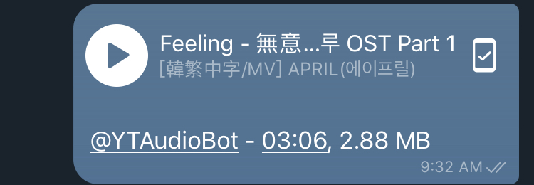
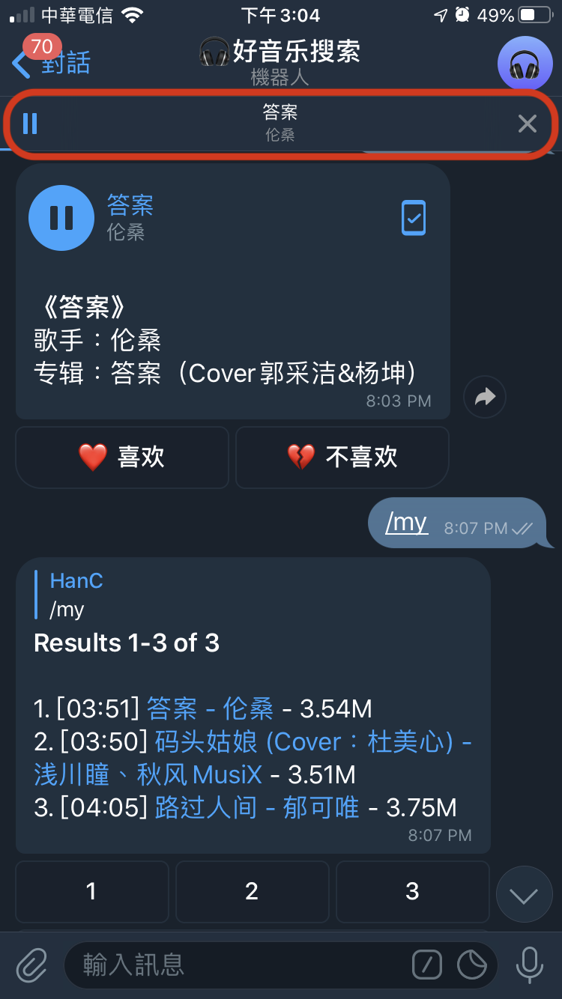
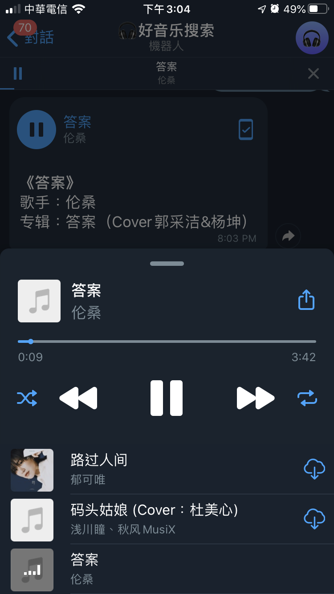

## 內建音樂播放器

## 目錄
1) [怎麼使用](#怎麼使用)
2) [音樂哪裡找](#音樂哪裡找)

---
---

### 怎麼使用
只要將音檔傳送至聊天室，接著會看到有「播放鍵」的符號，按下去就對了!  
 

按下去後，就會開啟「音樂播放器模式」，會看到上方有一排播放的符號，顯示目前播放的歌曲。  
 

再點下去，會看到整個聊天室的音樂列表(聊天室裡傳上來多少音檔，就有多少)。  
 

[🔱Home](../README.md)  [⬆️Top](#目錄)

---

### 音樂哪裡找
搜尋音樂的機器人 >> [好音樂搜索](https://t.me/haoyybot)

[🔱Home](../README.md)  [⬆️Top](#目錄)

---
### [⬅️2-6超強搜尋功能](./2-6超強搜尋功能.md) | [3-1訊息按右鍵功能➡️](../Ep3私訊篇/3-1訊息按右鍵功能.md)