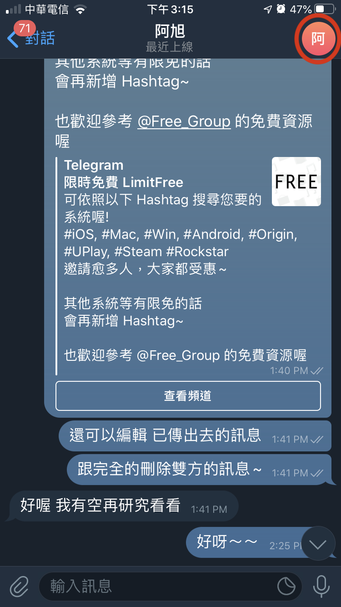
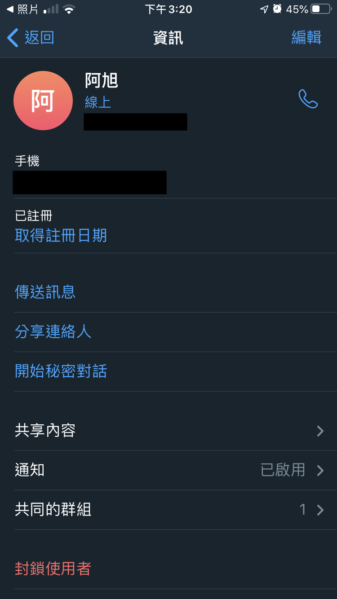
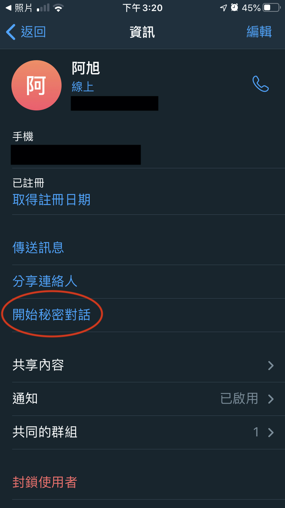

## 聊天室更多資訊

* [右上角的編輯](#右上角的編輯)
* [開始秘密對話](#開始秘密對話)
* [共享內容](#共享內容)
* [共同群組](#共同群組)

---
---

### 右上角的編輯
點選右上角，可以進行聊天室的編輯。  
 

點選右上角可編輯朋友的名字、刪除聯絡人。  

[⬆️Top](#目錄)

---

### 開始秘密對話
在對方上線時，可進行「自行銷毀訊息」的聊天室，且在秘密聊天室裡截圖的話，對方也會知道喔~  

[⬆️Top](#目錄)

---

### 共享內容
可查看在這個聊天室裡的「媒體」、「檔案」、「連結」、「音訊」  

[⬆️Top](#目錄)

---

### 共同群組
可查看與此聯絡人的共同群組有哪些  

[⬆️Top](#目錄)