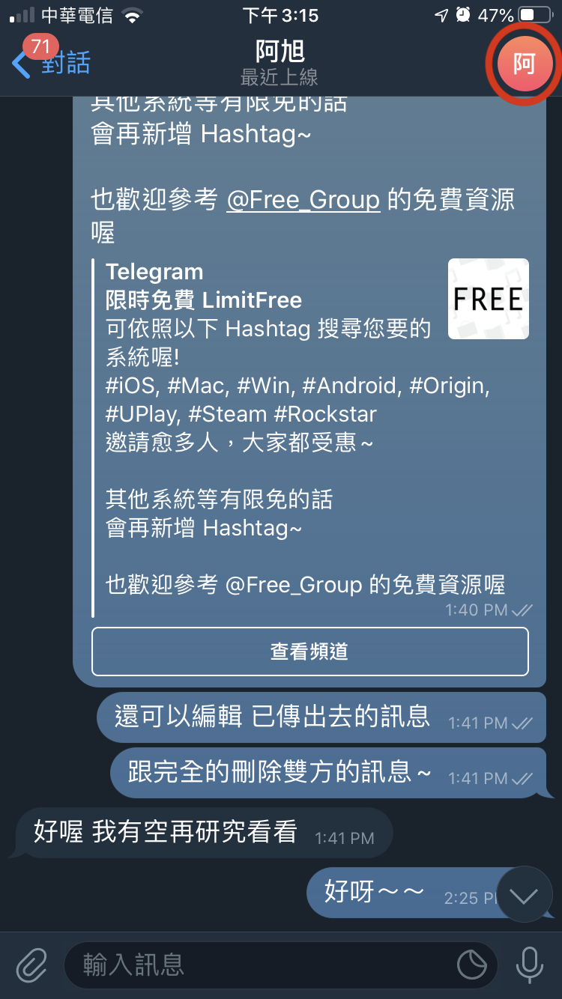
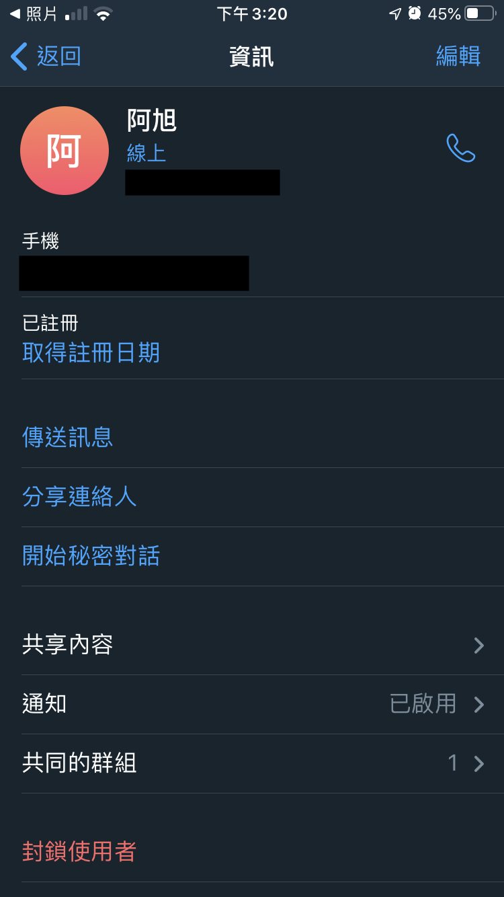
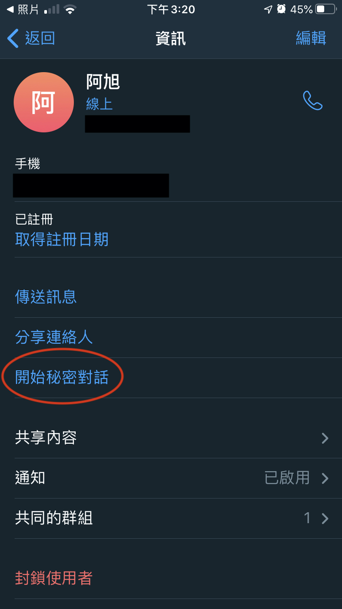

## 聊天室更多資訊

1) [編輯(右上角)](#編輯(右上角))
2) [開始秘密對話](#開始秘密對話)
3) [共享內容](#共享內容)
4) [共同群組](#共同群組)

---
---

### 編輯(右上角)
點選右上角，可以進行聊天室的編輯。  
 

點選右上角可編輯朋友的名字、刪除聯絡人。  

[🔱Home](../README.md)  [⬆️Top](#目錄)

---

### 開始秘密對話
在對方上線時，可進行「自行銷毀訊息」的聊天室，且在秘密聊天室裡截圖的話，對方也會知道喔~  

[🔱Home](../README.md)  [⬆️Top](#目錄)

---

### 共享內容
可查看在這個聊天室裡的「媒體」、「檔案」、「連結」、「音訊」  

[🔱Home](../README.md)  [⬆️Top](#目錄)

---

### 共同群組
可查看與此聯絡人的共同群組有哪些  

[🔱Home](../README.md)  [⬆️Top](#目錄)
