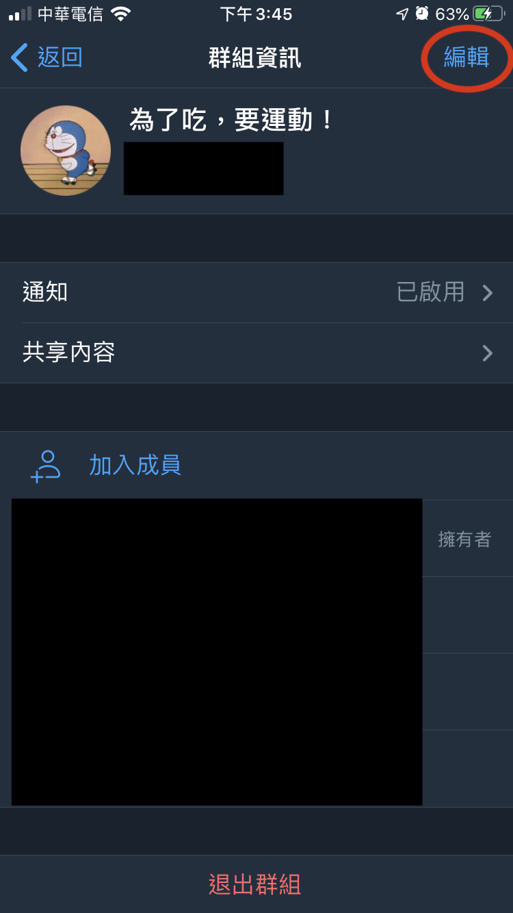

## 管理員

## 目錄
1) [設定群組資訊](#設定群組資訊)
2) [設定群組類型](#設定群組類型)
3) [允許新成員查看加入前的訊息](#允許新成員查看加入前的訊息)
4) [權限](#權限)
5) [設定其他管理員](#設定其他管理員)
6) [查看群組更改紀錄](#查看群組更改紀錄)

---
---

### 設定群組資訊
點選聊天室右上角的圖片。    

再點右上角的「編輯」。  

1) 設定群組圖片
2) 設定簡介  

[🔱Home](../README.md)  [⬆️Top](#目錄)

---

### 設定群組類型
- 會有群組連結

[🔱Home](../README.md)  [⬆️Top](#目錄)

---

### 允許新成員查看加入前的訊息

[🔱Home](../README.md)  [⬆️Top](#目錄)

---

### 權限

[🔱Home](../README.md)  [⬆️Top](#目錄)

---

### 設定其他管理員

[🔱Home](../README.md)  [⬆️Top](#目錄)

---

### 查看群組更改紀錄

[🔱Home](../README.md)  [⬆️Top](#目錄)

---